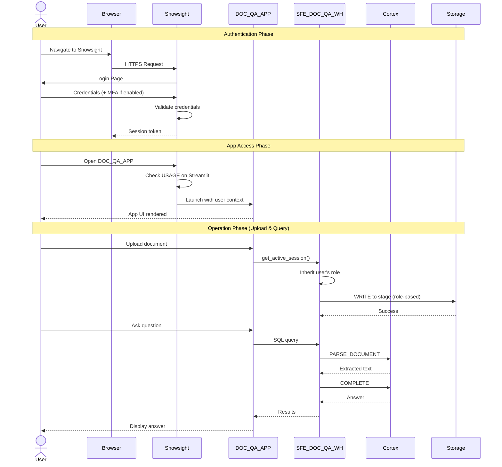

# Auth Flow - Document Rodeo

**Author:** SE Community  
**Last Updated:** 2025-12-05  
**Expires:** 2026-01-04 (30 days)  
**Status:** Reference Implementation


> **Reference Implementation:** This code demonstrates production-grade architectural patterns and best practices. Review and customize security, networking, and logic for your organization's specific requirements before deployment.

## Overview

This diagram shows the authentication and authorization flow for Document Rodeo. The application uses Snowflake's native authentication - users log in to Snowsight, and the Streamlit app inherits their session context. No separate auth system is required.



## Component Descriptions

### Snowsight Authentication
- **Purpose:** Authenticate users to Snowflake platform
- **Technology:** Snowflake native auth (username/password, SSO, SAML)
- **Location:** `<account>.snowflakecomputing.com`
- **Dependencies:** Valid Snowflake user account

### Streamlit App Authorization
- **Purpose:** Control who can access the Streamlit app
- **Technology:** Snowflake RBAC (USAGE privilege on Streamlit object)
- **Location:** `SNOWFLAKE_EXAMPLE.DOC_QA.DOC_QA_APP`
- **Dependencies:** GRANT USAGE ON STREAMLIT

### Session Context
- **Purpose:** Pass user identity to app queries
- **Technology:** Snowpark `get_active_session()`
- **Location:** Within Streamlit runtime
- **Dependencies:** User's current role and warehouse

### Object-Level Permissions
- **Purpose:** Control access to data objects
- **Technology:** Snowflake RBAC grants
- **Location:** Schema, stage, table grants
- **Dependencies:** Role hierarchy

## Required Grants

For users to access this demo, they need:

```sql
-- Minimum grants for a user/role to use the app
GRANT USAGE ON DATABASE SNOWFLAKE_EXAMPLE TO ROLE <user_role>;
GRANT USAGE ON SCHEMA SNOWFLAKE_EXAMPLE.DOC_QA TO ROLE <user_role>;
GRANT USAGE ON WAREHOUSE SFE_DOC_QA_WH TO ROLE <user_role>;
GRANT USAGE ON STREAMLIT SNOWFLAKE_EXAMPLE.DOC_QA.DOC_QA_APP TO ROLE <user_role>;
GRANT READ, WRITE ON STAGE SNOWFLAKE_EXAMPLE.DOC_QA.DOC_QA_STAGE TO ROLE <user_role>;
GRANT SELECT, INSERT ON TABLE SNOWFLAKE_EXAMPLE.DOC_QA.UPLOADS TO ROLE <user_role>;
```

## Security Model

| Layer | Mechanism | Notes |
|-------|-----------|-------|
| **Network** | TLS 1.2+ | Encrypted in transit |
| **Authentication** | Snowflake native | Username/password, SSO, MFA |
| **Authorization** | RBAC | Role-based grants |
| **Session** | Inherited context | App runs as user's role |
| **Data Access** | Object grants | Per-object permissions |
| **Cortex Access** | CORTEX_USER role | Required for LLM functions |

## Key Security Points

1. **No custom auth:** Leverages Snowflake's enterprise-grade authentication
2. **Session inheritance:** App queries run with user's permissions
3. **Audit trail:** All operations logged in Snowflake query history
4. **Role separation:** Users only see data their role can access
5. **No stored credentials:** No passwords or API keys in code

## Change History

See `.cursor/DIAGRAM_CHANGELOG.md` for version history.

