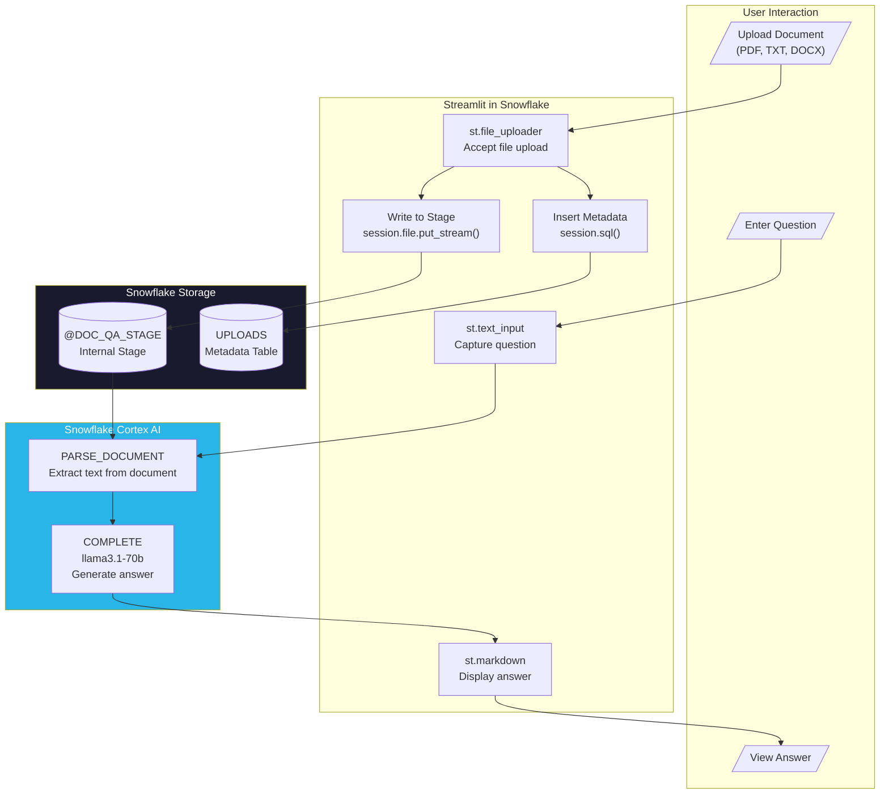

# Data Flow - Document Rodeo

**Author:** SE Community  
**Last Updated:** 2025-12-05  
**Expires:** 2026-01-04 (30 days)  
**Status:** Reference Implementation

> **Reference Implementation:** This code demonstrates production-grade architectural patterns and best practices. Review and customize security, networking, and logic for your organization's specific requirements before deployment.

## Overview

This diagram shows how document data flows through the Document Rodeo application - from user upload through text extraction to question answering. All processing happens within Snowflake using native Cortex AI functions.

## Component Descriptions

### User Interaction Layer
- **Purpose:** Provide interface for document upload and Q&A
- **Technology:** Streamlit widgets
- **Location:** `streamlit/streamlit_app.py`
- **Dependencies:** Streamlit in Snowflake

### Streamlit Application
- **Purpose:** Orchestrate upload, parsing, and Q&A workflow
- **Technology:** Streamlit in Snowflake (Python)
- **Location:** `SNOWFLAKE_EXAMPLE.DOC_QA.DOC_QA_APP`
- **Dependencies:** Snowpark session, Cortex functions

### Cortex AI Functions
- **Purpose:** Text extraction and LLM-based Q&A
- **Technology:** SNOWFLAKE.CORTEX.PARSE_DOCUMENT, SNOWFLAKE.CORTEX.COMPLETE
- **Location:** Built-in Snowflake functions
- **Dependencies:** Cortex access, warehouse compute

### Storage Layer
- **Purpose:** Persist documents and metadata
- **Technology:** Internal Stage + Table
- **Location:** `SNOWFLAKE_EXAMPLE.DOC_QA`
- **Dependencies:** Schema must exist

## Data Flow Steps

| Step | Action | Input | Output |
|------|--------|-------|--------|
| 1 | Upload file | User file selection | File bytes |
| 2 | Stage file | File bytes | Staged document |
| 3 | Record metadata | Filename, size, type | UPLOADS row |
| 4 | Parse document | Stage path | Extracted text |
| 5 | Generate answer | Question + text | LLM response |
| 6 | Display answer | LLM response | Formatted markdown |

## Change History

See `.cursor/DIAGRAM_CHANGELOG.md` for version history.

