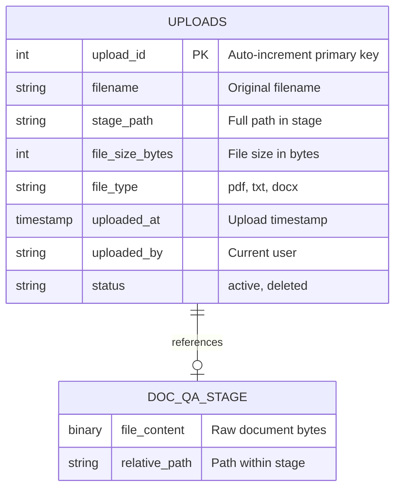

# Data Model - Document Rodeo

**Author:** SE Community  
**Last Updated:** 2025-12-05  
**Expires:** 2026-01-04 (30 days)  
**Status:** Reference Implementation

> **Reference Implementation:** This code demonstrates production-grade architectural patterns and best practices. Review and customize security, networking, and logic for your organization's specific requirements before deployment.

## Overview

This diagram shows the data model for Document Rodeo - a minimal document Q&A application. The model consists of a single metadata table tracking uploaded documents, with the actual documents stored in an internal stage.

## Component Descriptions

### UPLOADS Table
- **Purpose:** Track metadata for all uploaded documents
- **Technology:** Snowflake Table
- **Location:** `SNOWFLAKE_EXAMPLE.DOC_QA.UPLOADS`
- **Dependencies:** None

### DOC_QA_STAGE (Internal Stage)
- **Purpose:** Store actual document files (PDF, TXT, DOCX)
- **Technology:** Snowflake Internal Stage
- **Location:** `@SNOWFLAKE_EXAMPLE.DOC_QA.DOC_QA_STAGE`
- **Dependencies:** Schema must exist

## Data Dictionary

| Column | Type | Description |
|--------|------|-------------|
| `upload_id` | INT | Auto-incrementing primary key |
| `filename` | VARCHAR | Original filename from upload |
| `stage_path` | VARCHAR | Full stage path (e.g., `@DOC_QA_STAGE/doc.pdf`) |
| `file_size_bytes` | INT | Size of uploaded file |
| `file_type` | VARCHAR | File extension (pdf, txt, docx) |
| `uploaded_at` | TIMESTAMP_NTZ | When file was uploaded |
| `uploaded_by` | VARCHAR | User who uploaded (CURRENT_USER()) |
| `status` | VARCHAR | Document status (active/deleted) |

## Change History

See `.cursor/DIAGRAM_CHANGELOG.md` for version history.

