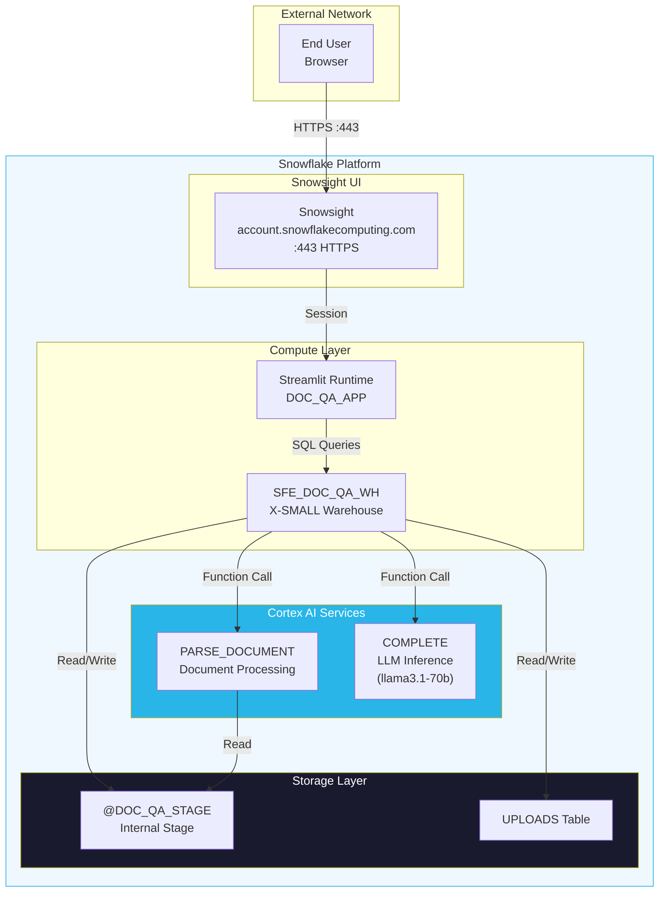

# Network Flow - Document Rodeo

**Author:** SE Community  
**Last Updated:** 2025-12-05  
**Expires:** 2026-01-04 (30 days)  
**Status:** Reference Implementation

> **Reference Implementation:** This code demonstrates production-grade architectural patterns and best practices. Review and customize security, networking, and logic for your organization's specific requirements before deployment.

## Overview

This diagram shows the network architecture for Document Rodeo. Being 100% Snowflake-native, all traffic stays within the Snowflake platform boundary. Users access the Streamlit app via Snowsight - no external services or network egress required.

## Component Descriptions

### External Access
- **Purpose:** User access to Snowflake
- **Technology:** HTTPS/TLS 1.2+
- **Location:** `<account>.snowflakecomputing.com`
- **Dependencies:** Valid Snowflake credentials

### Snowsight UI
- **Purpose:** Web interface for Snowflake
- **Technology:** Snowflake web application
- **Location:** Port 443 (HTTPS)
- **Dependencies:** Browser, network access

### Compute Layer
- **Purpose:** Execute queries and run Streamlit
- **Technology:** Virtual Warehouse, Streamlit Runtime
- **Location:** `SFE_DOC_QA_WH`, `DOC_QA_APP`
- **Dependencies:** Warehouse credits

### Cortex AI Services
- **Purpose:** Document parsing and LLM inference
- **Technology:** Managed Snowflake services
- **Location:** Internal to Snowflake platform
- **Dependencies:** Cortex access (CORTEX_USER role)

### Storage Layer
- **Purpose:** Persist documents and metadata
- **Technology:** Snowflake storage
- **Location:** `SNOWFLAKE_EXAMPLE.DOC_QA`
- **Dependencies:** Storage allocation

## Network Security

| Aspect | Implementation |
|--------|----------------|
| **Encryption in Transit** | TLS 1.2+ (Snowflake managed) |
| **Encryption at Rest** | AES-256 (Snowflake managed) |
| **Authentication** | Snowflake native (username/password, SSO, MFA) |
| **Authorization** | RBAC via Snowflake roles |
| **Network Egress** | None required (fully internal) |
| **External Access** | Not required |

## Key Points

- **Zero network egress:** All processing stays within Snowflake
- **No external integrations:** No API keys, webhooks, or external services
- **Single entry point:** Users access only via Snowsight
- **Managed security:** TLS, encryption, auth all handled by Snowflake

## Change History

See `.cursor/DIAGRAM_CHANGELOG.md` for version history.

